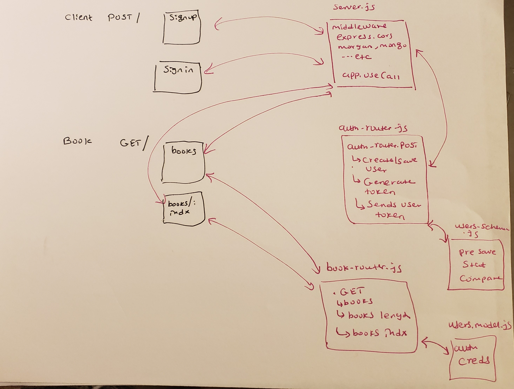

# lab-10
Authentication

* [Travic-cs](https://www.travis-ci.com/meron-401n14/lab-10)
* [Heroku](https://lab-10-authentication.herokuapp.com/)
* [SubmissionPR](https://github.com/meron-401n14/lab-10/pull/1)

#### Instructions for how to run your application
  * npm start
#### Instructions for how to test your application
  * npm test

### TODO README Question
  * Q1. Currently, the client is just sending us an object containing the username and password to us, which is why we can just pass along (req.body). What is a better way to do this?

  * Ans: Hashing user password 

  * Q2. What are the pros and cons of setting res.cookie?
  * ans: pros: it helps the user a client from re authenticate process every time to use the website
       cons:  Security issue by exposing the login information 

  * Q3. What does .isModified do and why do we use it?
    * Ans: It modifies data and it is used to modify user password by hashing and bcrypt 

  * Q4.Currently, the client is just sending us an object, containing the username and password to us, 
  *  which is why we can just pass along (req.body). What is a better way to do this?
  ans:  when we save a user record , we want to save a hased version of our password bcrypt.hash(password)
  * everytime a user tries to signin compare thier credentials with the stored hashed password 
  

* 

